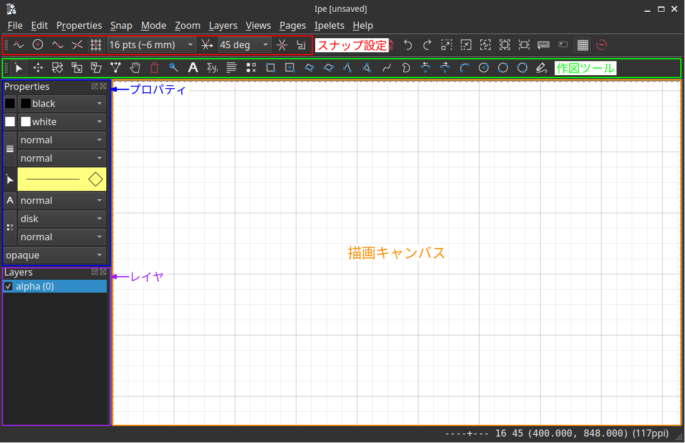

Ipeは，ベクター形式の図・スライド・ポスターを作成できるフリーのドローソフトウェアです．（[公式サイト](http://ipe.otfried.org/) / [Wikipedia](https://ja.wikipedia.org/wiki/Ipe)）

本記事では，はじめてIpeを使う方に向けて導入方法や基本操作を解説します．
また，後半では筆者が個人リポジトリ（[IpeExample](https://github.com/keigosuzuki/IpeExample)）で管理している設定構成や，スライド作成などの応用機能を紹介します．

---

## 1. はじめに

### 1.1 TeXとの親和性
Ipeは単なるドローソフトではなく，バックグラウンドでTeXエンジンを呼び出してテキストや数式をレンダリングします．
特に数式において論文本文と体裁を統一しやすい利点があります．
また，種々のLaTeXパッケージを利用することができます．

### 1.2 ファイル形式
編集可能なファイル形式として `.ipe` （実体はXMLデータ）と `.pdf` があります．
加えてPNG / EPS / SVG形式でのエクスポートが可能です．
Ipeで作図した図を論文原稿（LaTeX）内にPDF形式で挿入，修正が必要になった際もIpeで直接再編集する，という運用ができます．

### 1.3 他ツールとの使い分け
- PowerPoint: 一般的なプレゼンテーションや手早い概念図に向いています．デファクトスタンダードであるという大きな利点があります．LaTeX数式の挿入には工夫が必要です．
- Illustrator / Inkscape: デザイン性の高い図の作成に向いています．
- Ipe: 幾何学的な図，ブロック図，数式を多用する図の作成に向いています．

---

# 基本編

## 2. 基本操作



### 2.1 よく使うショートカット一覧

| 分類 | 操作 | ショートカット |
| :--- | :--- | :--- |
| モード切替 | 選択モード | `s` |
| | 移動モード | `t` |
| | 回転モード | `r` |
| | 伸縮・変形モード | `e` |
| | テキスト（ラベル） | `l` |
| | テキスト（パラグラフ） | `g` |
| 編集 | オブジェクトの編集 | `Ctrl+e`（または右クリック） |
| | グループ化 / 解除 | `Ctrl+g` / `Ctrl+u` |
| | 最前面へ / 最背面へ | `Ctrl+f` / `Ctrl+b` |
| | LaTeX再コンパイル | `Ctrl+l` |
| 表示・ズーム | 用紙全体を表示（Fit page） | `\` |
| | 選択オブジェクトにズーム | `@` |
| | 全オブジェクトにズーム | `=` |

### 2.2 グリッドとスナップの設定
グリッドとスナップを使うことで，自然と整った配置になります．
PowerPointなどでもグリッドを使うことはできますが，Ipeの方が高速が強力な体感があります．

- グリッドの選択: ドロップダウンから作図の細かさに応じた間隔（4 pts, 8 pts, 16 pts 等）を選択します．
- スナップ機能の有効化: アイコンをクリック（またはファンクションキー）してスナップを有効にします．
  - いくつかオプションがありますが，基本的にはデフォルトのGrid Snap（`F7`）で十分です．

### 2.3 基本図形の挿入
画面上部の作図ツールバー（またはショートカット）から選択して図形を描画します．

- 直線・曲線（`i`）: クリックで頂点を指定していき，ダブルクリックで確定します．
- 長方形（`b`）: 対角の2点をクリックして作成します．
- 円（`o`）/ 円弧（`a`）: 中心点と円周上の点を指定して作成します．
- 選択と変形: 選択モード（`s`）に切り替えることで，図形の移動，ドラッグによる変形（`e`），回転（`r`）が行えます．

### 2.4 テキストの挿入
作図ツールバーのテキスト関連ツールで，文字や数式を配置します．

- ラベル（`l`）: 単一行のテキストや数式を挿入します．画面をクリックすると入力ダイアログが開き，通常の文字列や `$ ... $` によるインライン数式を記述します．
- パラグラフ（`g`）: 複数行にわたる文章や，幅を指定したテキストブロックを配置します．
- 編集: 配置したテキストは，選択して `Ctrl+e` で再編集できます．

### 2.5 プロパティの調整
画面左側のプロパティパネル（または右クリックメニュー）から，オブジェクトのスタイルを設定します．

- Stroke / Fill color: 線の色と塗りつぶしの色を指定します．
- Pen width: 線の太さを選択します．
- Dash style: 線種（実線 / 破線 / 点線）を選択します．
- Forward / Reverse arrow: 線分の始点・終点に矢印を付与します．
- Text size: フォントサイズを変更します．

---

## 3. スタイル・設定のカスタマイズ

### 3.1 ユーザ設定の仕組み
Ipeの描画スタイルや作業環境は，スタイルシート（XML）と設定スクリプト（Lua）によって自由にカスタマイズすることができます．
逆に言えば，カスタマイズを加えない素の状態での自由度は低いです．

- スタイルシート（`.isy`）: カラーパレット，フォント設定，用紙レイアウト，プリアンブル（`\usepackage` 等）を定義します．1つのファイルに対して複数のスタイルシートを重ねて適用でき，`File` / `Edit` > `Style sheets` から追加・削除・更新します．
- 設定スクリプト（Lua）: Ipe内部はLuaで制御されており，エディタの挙動やショートカットキー，拡張機能（ipelet）を独自に追加・変更できます．

### 3.2 筆者の設定例
筆者がGitHub上で公開している [IpeExample](https://github.com/keigosuzuki/IpeExample) リポジトリでは，スタイル設定や独自スクリプト（ipelet），テンプレートをまとめています．
ぜひ参考にしてください．

```text
IpeExample/
├── docs/            # Ipe 入門・活用ガイド，作例・デモ
├── styles/          # スタイルシート（カラーパレット，フォント，用紙レイアウト）
├── ipelets/         # 拡張スクリプト（追加図形，表，グラフ・ベクター図取込等）
└── templates/       # 発表用スライド・ポスターのテンプレート（白紙雛形）
```

#### 外部スタイルの読み込み設定（参考）
ユーザ設定のスタイルやスクリプトをIpeに自動認識させたい場合は，環境変数でパスを通します．

- Linux / macOS: `~/.config/ipe/ipe.conf` に `IPESTYLES = /path/to/IpeExample/styles:_` および `IPELETPATH = /path/to/IpeExample/ipelets:_` などと指定します．
- Windows: システム環境変数に `IPESTYLES` と `IPELETPATH` を登録します（パス区切りはセミコロン `;`，末尾に `;_` を付加）．

---

# 応用編

## 4. コンパイル設定

`File` / `Edit` > `Document properties` からコンパイル時に使うLaTeXエンジンを選択することができます．

### 4.1 pdfTeX と LuaTeX の比較

| 項目 | pdfTeX | LuaTeX |
| :--- | :--- | :--- |
| コンパイル速度 | 高速 | 遅い |
| フォントの自由度 | 低い<br>（TeX環境同梱のフォントに限定されやすい） | 高い<br>（OS上の任意のOTF/TTFフォントを直接指定可能） |
| 日本語の扱い | 設定やパッケージの指定がやや煩雑 | `luatexja` により容易かつ自然に扱える |

普段の軽快な作図や欧文主体の論文図版には pdfTeX が手軽ですが，日本語スライドや特定の指定フォントを用いたい場合は LuaTeX が適しています．

### 4.2 iftex によるワークアラウンド
スタイルシート（`.isy`）内で `iftex` パッケージを利用してエンジン判定を行うことで，1つのスタイルファイルで両方のエンジンに対応させることができます．

<details><summary>設定例</summary>

```xml
<ipestyle name="font_example">
<preamble>
\usepackage{iftex}

\ifluatex
\usepackage[deluxe,expert,haranoaji]{luatexja-preset}
\setsansfont{Noto Sans}
\setsansjfont{Noto Sans CJK JP}
\renewcommand{\familydefault}{\sfdefault}
\else\ifpdftex
\usepackage{amsmath}
\usepackage{newtxtext}
\usepackage[whole]{bxcjkjatype}
\renewcommand{\familydefault}{\sfdefault}
\fi\fi
</preamble>
</ipestyle>
```

</details>

---

## 5. スライド作成

### 5.1 スライドの階層構造
以下の階層構造にしたがってページを追加することで，1つのファイル内で発表スライドを作成できます．

- Page: スライド各ページ．
- Layer: オブジェクトが属する層．
- View: 1ページ内での表示段階．Viewごとに表示するLayerを指定することで，クリックに応じた段階的表示（アニメーション）を実現します．

### 5.2 動画の埋め込み（Pympress連携）
Ipeで作成したスライドの出力ファイル形式はPDFであり携帯性は高い一方，そのままでは動画を埋め込めないという難点があります．
詳細は省きますが，ファイルへのリンクとして動画を埋め込み，かつ対応したプレゼンターツールを使うことでPDFスライド内で動画を再生することができます（正しいパスに動画ファイルが配置されている必要あり）．
`IpeExample` では，クロスプラットフォームのプレゼンターツール Pympress で再生できるよう動画を埋め込むスクリプト（`video.lua`，`inject_media.py`）を用意しています．

---

## 6. トラブルシューティング

- `LaTeX error occurred` が出て保存・再描画できない場合: 記述した数式コードの文法エラー（括弧の閉じ忘れやマクロのスペルミス）が原因です．`File` > `Show LaTeX log` から詳細ログを確認できます．
- 日本語が表示されない・文字化けする場合: `Edit` > `Document properties` で TeX engine が `luatex` に設定されているか，またスタイルシートで指定しているフォントがPCに正しくインストールされているかを確認してください．
